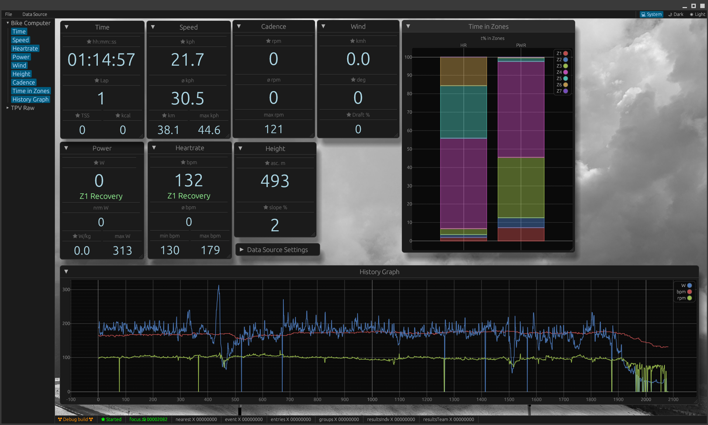

# TPVUI

A GUI which displays [TrainingPeaks Virtual](https://www.trainingpeaks.com/virtual/) data from [broadcast / streaming](https://help.trainingpeaks.com/hc/en-us/articles/31341004973453-TrainingPeaks-Virtual-Broadcast-Streaming-Mode) mode.

This is in very early stage. No releases yet. But the project installs a set of github actions which will build _nightlies_ for _Windows_ and _Ubuntu_ on every push. You could download the artifacts for successful CI runs [here](https://github.com/wendlers/tpvui/actions/workflows/rust.yml). 



## Usage

Currently TPVUI will __not__ be able directly consume the local _bcast_ files from TPV (but this is a planned feature). Instead, TPVUI will try to do get-request against a HTTP server returning the JSON files from TPVs bcast directory. A simple HTTP-server doing exactly that job is developed in a separate project called TPVBC2HTTP. For details [see the project page](https://github.com/wendlers/tpvbc2http). However to get everything up and running this steps are required: 

Start TPCBC2HTTP (get executable from nightly [here](https://github.com/wendlers/tpvbc2http/actions/workflows/rust.yml)) on the same machine on which TPV will be executed: 

```
tpvbc2http.exe -t %HOMEDRIVE%%HOMEPATH%\Documents\TPVirtual\Broadcast\
```

When started the first time, you will be asked to grant firewall access to this app (so it could open port 8080). Set the check-boxs for all networks.

Start TPVUI on the same machine as TPV and TPVBC2HTTP or if you like on a second machine in the same network by double clicking ``tpvui.exe``. In the menu select _Data Source/Settings_ and make sure to change the hostname / IP if you run TPVUI on a different machine. 
Now select _Data Source/Start receiving_ in the menue. If the data collector is able to fetch data from the HTTP server, all the sources in the status line should go from gray to green and start upcounting (in different speeds). If the connection fails or the data received is invalid for a source, it will turn red in the status line.

To watch the the data received live, select the information you are intrested in on the left side panel. Multiple views could be opend and arranged in the center area. 

## Build / Run from Source

Make sure you are using the latest version of stable rust by running `rustup update`.

`cargo run --release`

On Linux you need to first run:

`sudo apt-get install libxcb-render0-dev libxcb-shape0-dev libxcb-xfixes0-dev libxkbcommon-dev libssl-dev`

On Fedora Rawhide you need to run:

`dnf install clang clang-devel clang-tools-extra libxkbcommon-devel pkg-config openssl-devel libxcb-devel gtk3-devel atk fontconfig-devel`
